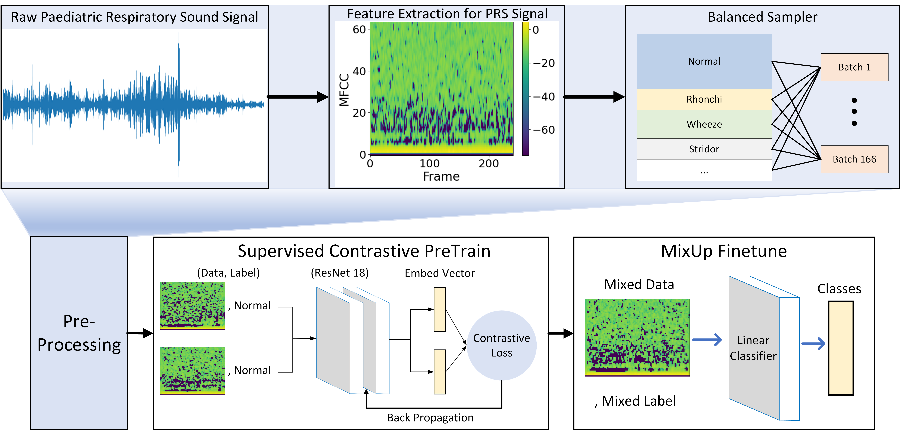
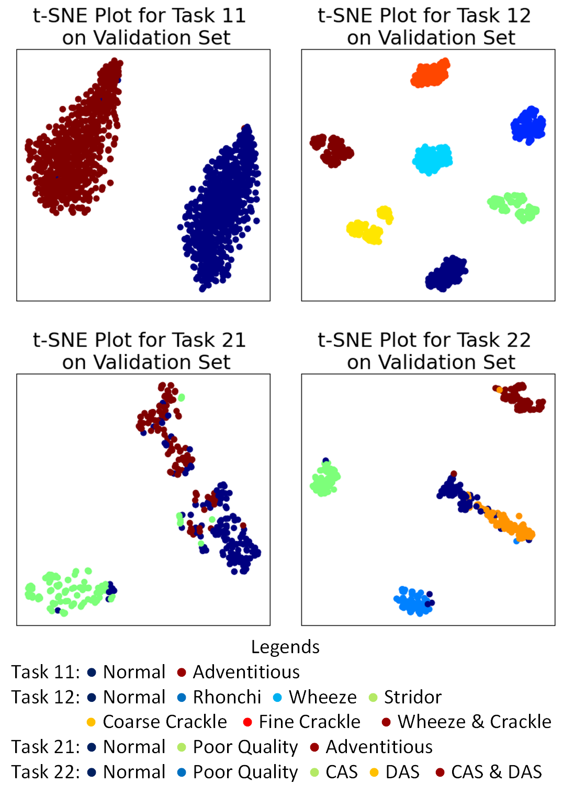
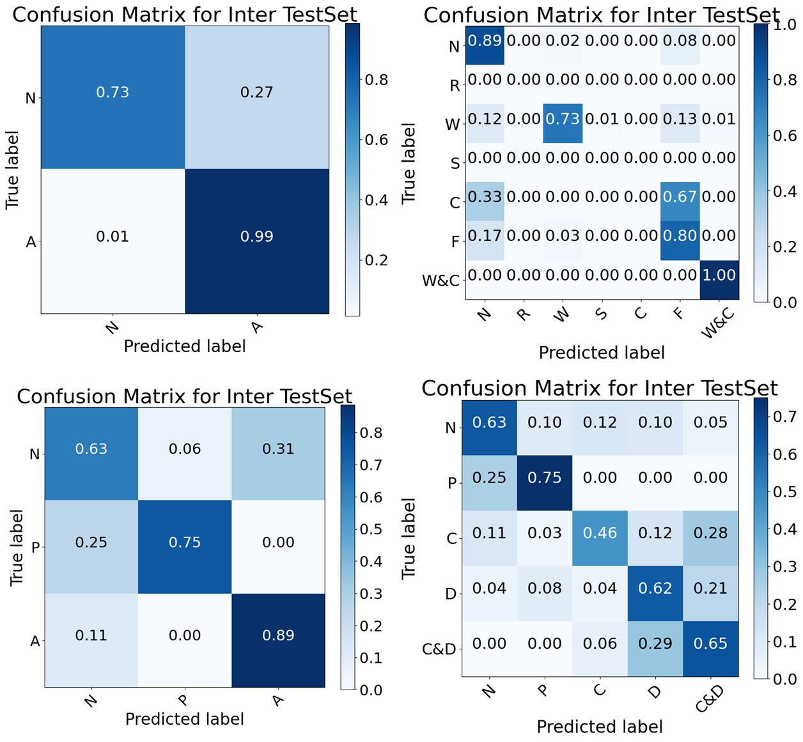

#   BioCAS 2023 Grand Challenge

This repository contains code for respiratory sound classification in BioCAS 2023 Grand Challenge. 

##  Table of Content
1. [Structure](#structure)
2. [Execution](#execution)
3. [Customization](#customization)
4. [Architecture](#architecture)
5. [Results](#results)
6. [Updates](#updates)
7. [License](#license)
8. [Acknowledgement](#acknowledgement)

##  Structure
```
./BioCAS2023/
|
├───ckpts
│   ├───PreTrain-Models
│   └───FineTune-Models
├───logs
├───models
│   ├───11
│   ├───12
│   ├───21
│   └───22
├───SPRSound
│   ├───example
│   ├───test_json
│   │   ├───inter_test_json
│   │   └───intra_test_json
│   ├───test_wav
│   ├───train_json
│   └───train_wav
├───src
│   ├───data
│   ├───models
│   ├───utils
│   ├───train.py
│   └───test.py
├───.gitignore
├───backtest.ipynb
├───BioCAS-Notes.ipynb
├───environment.yml
├───LICENSE
├───main-finetune.py
├───main-pretrain.py
├───main.py
├───README.md
├───requirements.txt
├───Submission Documentation.pdf
├───tuning-hyperparameter.py
├───tuning-preprocessing.py
└───tuning-supcon.ipynb
```

##  Execution
This section will bring you across in running the code for deployment. 
### Set up the environment
Step 1 - Following the structure as shown above, download the dataset into the current directory after cloning this repository. The data can be found at https://github.com/SJTU-YONGFU-RESEARCH-GRP/SPRSound. \
Step 2 - To install all the dependencies, it is recommended to create a new environment first. The `requirements.txt` is available in this directory for manual installation. 
```
pip install -r requirements.txt
```
Alternatively, a new environment can be created with the dependencies by using the `environment.yml`.
```
conda env create --name BIOCAS23 --file environment.yml
conda activate BIOCAS23
```
### Running the main file
All models with their states and the configs have been pushed into this repository. As such, it is not required to train the models before running `main.py`. However, details on how to customize the models are explained in the section on Customization.\
To execute the code, the following command should be used:
```
python3 main.py --task task_level --wav /path/to/wav_path/ --out /path/to/output.json
```
Note that `task_level`, `/path/to/wav_path/`, and `/path/to/output.json` are up to user's preference. `task_level` accepts the following arguments:\
"11, "12", "21", or "22"


Details on the dataset and challenge can be found at the [BioCAS 2023 Grand Challenge Homepage](https://2023.ieee-biocas.org/grand-challenge).

## Customization
### Basic - Training or modification
To retrain or modify the models, users can use the the following example commands:
- If Supervised Contrastive (SupCon) Pretrain + Finetune is used, both `main-pretrain.py` and `main-finetune.py` are required to run. 

    For SupCon pretraining: run following command and the pretrained model will be saved under `ckpts/PreTrain-Models/Task_(task_level)` 
    ```
    python main-pretrain.py --task=11 --model=resnet18
    ```
    For MixUp finetuning: run following command and the fintuned model will be saved under `ckpts/FineTune-Models`
    ```
    python main-finetune.py --mode=train --task=11 --model_type=SupCon --save_model
    ```
- If use other models such as CNN, ResNet, or SNN without pretraining:
    ```
    python main-finetune.py --mode=train --task=11 --model_type=ResNet --epoch=100 --save_model
    ```
To test and view results of finetuned model: 
```
python main-finetune.py --mode=test --task=11
```
Save finetuned model into `\models\task_level` by key in 'Y' or 'y' in the prompt. The model will be renamed as `model.pt`.

Users will have to ensure that the models trained is aligned to the `config.json` within the `\models\` sub-directories, and can be modified accordingly.

The models and preprocessing can be edited accordingly in their source code both at `main-pretrain.py` and `main-finetune.py` respectively. The commands and configuration are currently contained within the code with their comments. To directly access the source code for the preprocessing and models, do refer to the `\src\` directory.

### Pofiling script using simple memory profiler
1. Install memory-profiler from conda using `conda install -c conda-forge memory_profiler` (see https://pypi.org/project/memory-profiler/).
2. Run on terminal `mprof run main.py -ARGUMENTSandETC`.
3. Run `mprof plot` to plot the memory used with time.

### Tuning Hyperparameters using Tune
Model hyperparameters can be tuned using `python tuning-hyperparameter.py` with their arguments stated within the source file.\
Similarly, preprocessing parameters can be tuned using `python tuning-preprocessing.py`.

## Architecture
The overall architecture is illustrated in the schematic diagram shown below.\
 

## Results
- The T-SEN plots after pretraining are shown below.


- The confusion matrixs to obatin best test scores are shown below.
 

## License
This project is licensed under the MIT License. See LICENSE for more details.

## Updates
- [x] Score evaluation (in test.py) - Score and verbosity control aligned to assessment criteria (JHU)
- [x] Enlarge dataset (Add noise...) (JHU)
- [x] Experiment with different features - MFCC, CWT, tempogram (CLEOW)
- [x] Experiment with different signal-procesisng methods - clipping, pre-emp (CLEOW, JHU)
- [x] Allow script to automatically adjust non-spiking model size based on feature (JHU)
- [x] Choose optimal feature (1-2) and implment hyperparameter search (CLEOW)
- [x] Experiment with different MFCC parameters - at various optimization and different epochs, the maximum achievable score for the CNN is around 86-87% with hop_length = 256, N_F_BIN = 32, and N_FFT = 512 while c1=2, c2=64, l1=256, l2=32 (in feed-forward order) (CLEOW)
- [x] Test dataset (JHU)
- [x] Dedicated preprocessing function for evaluation.
- [x] Adjust different strategy for best model selection in training (JHU)
- [x] Update tuning scripts with strategies (CLEOW)
- [x] Train, test and save model checkpoints for pipeline design (CLEOW)
- [x] Supervised contrastive pre-training (JHU)
- [x] Prepare full pipeline for submission (CLEOW, JHU)
- [ ] Experiment with ensemble/meta-learning approaches - e.g. locations (JHU, Shuailin)

## Acknowledgement
Authors: Hu Jinhai*, Leow Cong Sheng*, Tao Shuailin\
This project have been built on some of the useful repositories and tools shown below (in no particular order):
- Previous year challenge submission - https://github.com/chenzizhao/biocas-challenge-22
- SupContrast: Supervised Contrastive Learning - https://github.com/HobbitLong/SupContrast
- Mixup - https://github.com/facebookresearch/mixup-cifar10
- snnTorch - https://snntorch.readthedocs.io/en/latest/
- Ray Tune - https://docs.ray.io/en/master/ 


*These two authors contributed equally to this work
